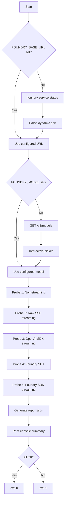
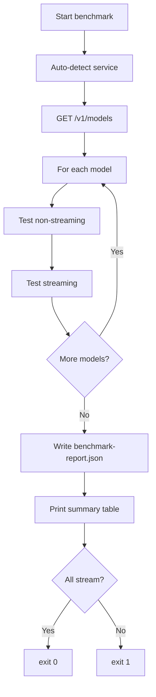
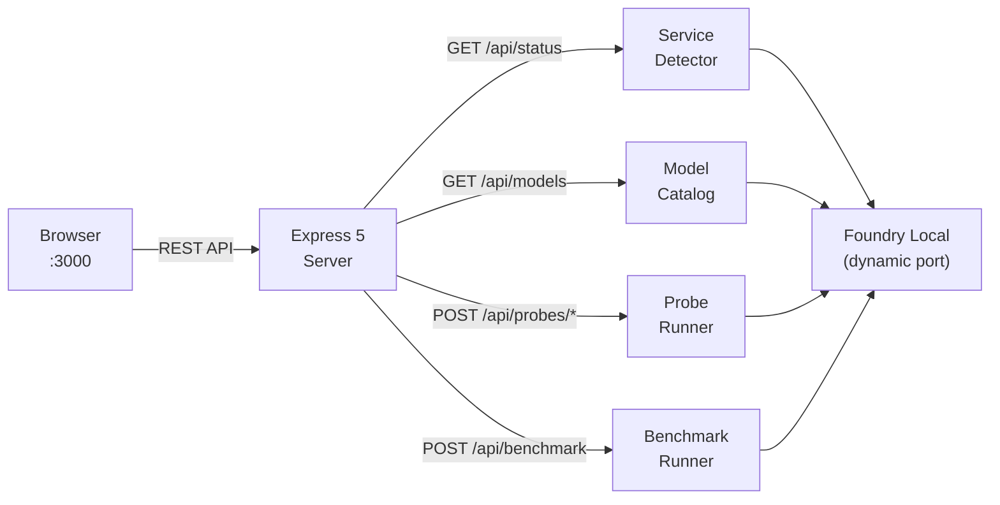

<!-- badges -->
<p align="center">
  <a href="https://nodejs.org/"></a>
  <a href="https://www.typescriptlang.org/"></a>
  <a href="https://opensource.org/licenses/MIT"></a>
  <a href="https://www.npmjs.com/package/openai"></a>
  <a href="#"></a>
  <a href="#"></a>
</p>

<h1 align="center">🔍 Foundry Local Streaming Validation</h1>

<p align="center">
  Diagnose and reproduce the <strong>Foundry Local v0.5 streaming hang</strong> — where
  <code>stream:true</code> never produces SSE events while <code>stream:false</code> works fine.<br>
  Now with <strong>automatic port detection</strong>, <strong>multi-model streaming benchmark</strong>, and a <strong>web-based dashboard</strong>.
</p>

---

## Why Streaming Matters for SLMs

Streaming is essential for Small Language Models because it transforms limited compute into a great user experience. In an SLM context, streaming isn’t a luxury — it’s how you make the model feel fast, capable, and interactive despite running on constrained hardware.

---

## 1. Hides Latency on Slow or Edge Hardware

SLMs often run on CPUs, NPUs, or mobile devices, where token generation is slower than cloud LLMs.  
Streaming masks this by showing output immediately, even while the model is still thinking.

---

## 2. Enables Early Termination (Huge for Efficiency)

Users often get what they need in the first few tokens.  
Streaming allows early stopping, saving:

- battery  
- compute  
- memory  

Perfect for on‑device workloads.

---

## 3. Makes SLMs Feel “Instant” and Conversational

Responsiveness matters more than raw speed.  
Streaming gives the perception of intelligence and fluidity, even when the model is small.

---

## 4. Supports Real-Time Interaction and Control

Developers can:

- interrupt generation  
- steer the model mid‑response  
- update UI incrementally  

This is critical for copilots, agents, and embedded apps.

---

## 5. Improves Safety and Guardrails

Streaming enables:

- real‑time moderation  
- stopping unsafe drift early  
- adaptive correction

This tool validates **Foundry Local**'s OpenAI-compatible `/v1/chat/completions` endpoint using **five independent probes**:

| # | Probe | Method | What it tests |
|---|---|---|---|
| 1 | **Non-streaming** | `fetch` · `stream: false` | Baseline — proves the endpoint is reachable and returns valid JSON |
| 2 | **Raw streaming** | `fetch` + hand-rolled SSE parser · `stream: true` | Direct SSE test with byte-level TTFB and first-event timing |
| 3 | **Copilot SDK BYOK** | `openai` npm package · `stream: true` | Reproduces the code path GitHub Copilot BYOK uses for OpenAI-compatible endpoints |
| 4 | **Foundry SDK** | `@prathikrao/foundry-local-sdk` · non-streaming | Tests the official Foundry Local SDK |
| 5 | **Foundry SDK Streaming** | `@prathikrao/foundry-local-sdk` · streaming | Tests streaming via the Foundry SDK |

### 🖥️ Web Dashboard

In addition to the CLI, a **browser-based dashboard** lets you interact with every feature visually — detect the service, browse models, run probes, and execute benchmarks right from your browser.

<p align="center">
  <br>
  <em>Service auto-detection and model catalog with one-click selection</em>
</p>

<p align="center">
  <br>
  <em>Full-page view: all three probes passing with OK status, timing metrics, and streamed token preview</em>
</p>

<p align="center">
  <br>
  <em>Detailed probe results showing TTFB, first-event timing, chunk counts, and [DONE] confirmation</em>
</p>

Start the dashboard with:

```bash
npm run web        # production (requires build first)
npm run web:dev    # development (via ts-node)
```

Then open **http://localhost:3000** in your browser.

### 🌐 Automatic port detection

Foundry Local starts on a **dynamic port** each time. This tool automatically detects the port by running `foundry service status`:

```
🔍  Detecting Foundry Local service...
🟢 Model management service is running on http://127.0.0.1:51995/openai/status

✔  Detected Foundry Local on port 51995
   Auto-set FOUNDRY_BASE_URL = http://127.0.0.1:51995/v1
```

- If `FOUNDRY_BASE_URL` is **not set** in `.env`, the tool auto-detects the port at startup
- If `FOUNDRY_BASE_URL` **is set**, the configured value is used as-is
- Works in both the scripts (`run-all.ps1` / `run-all.sh`) and the Node.js entry point

### ✨ Interactive model selection

If `FOUNDRY_MODEL` is not set in `.env`, the tool **automatically queries** the Foundry Local model catalog at `/v1/models` and presents an interactive picker in your terminal:

```
  #   Model ID                          Owner
  ────────────────────────────────────────────────────────────
    1  Phi-4-cuda-gpu:1                  Microsoft
    2  Phi-4-mini-instruct-cuda-gpu:5    Microsoft
    3  qwen2.5-0.5b-instruct-cuda-gpu:4  Microsoft

  Available models:
    1) Phi-4-cuda-gpu:1
    2) Phi-4-mini-instruct-cuda-gpu:5
    3) qwen2.5-0.5b-instruct-cuda-gpu:4

  Select a model (1-3) or type model name: _
```

You can also type a model name directly or use an alias (e.g., `phi-4-mini`). The tool automatically resolves aliases to full variant IDs. In non-interactive mode (CI/piped), the first available model is auto-selected.

### 📋 Version information

Both the CLI and web dashboard display version information at startup:

```
  Version Information:
  App version        : 1.0.0
  Node.js            : 24.13.0
  Foundry CLI        : 0.8.119
  Foundry SDK        : 0.0.12
  OpenAI SDK         : 4.104.0
  Detection method   : CLI
```

### 🏁 Multi-model streaming benchmark

The new **benchmark** mode tests **every model** in your Foundry Local catalog for streaming support:

```bash
npm run benchmark
# or
.\scripts\run-all.ps1 -Benchmark
bash scripts/run-all.sh --benchmark
```

It produces a summary table and a `benchmark-report.json`:

<p align="center">
  <br>
  <em>Service auto-detection and model catalog with one-click selection</em>
</p>

### 🔑 Key design principles

- ❌ **No proxies, interceptors, or SSE re-encoding** — every probe talks directly to Foundry Local
- ❌ **No external SSE libraries** — the parser is a minimal hand-rolled async generator
- 🔒 **No secrets logged** — request payloads appear only as SHA-256 hash prefixes
- ⏱️ **Three-layer timeouts** (`REQUEST_TIMEOUT_MS`, `FIRST_BYTE_TIMEOUT_MS`, `FIRST_EVENT_TIMEOUT_MS`) ensure the tool **never hangs**
- ✅ **TypeScript strict mode** throughout

---

## Quick start

### Prerequisites

| Requirement | Details |
|---|---|
| **Node.js** | ≥ 18 (native `fetch` required) |
| **Foundry Local** | Running (`foundry service status` should show 🟢) |

### 1. Clone & install

```bash
git clone <repo-url> foundry-local-streaming-validation
cd foundry-local-streaming-validation
npm install
```

### 2. Build

```bash
npm run build
```

### 3. Configure (optional)

```bash
cp .env.example .env
```

> **All settings are optional.** The tool auto-detects the Foundry Local port and prompts you to pick a model. Edit `.env` only if you want to override behaviour.

```env
# FOUNDRY_BASE_URL=http://127.0.0.1:5272/v1   # auto-detected if omitted
# FOUNDRY_MODEL=phi-4-mini                     # interactive picker if omitted
FOUNDRY_API_KEY=unused
REQUEST_TIMEOUT_MS=30000
FIRST_BYTE_TIMEOUT_MS=10000
FIRST_EVENT_TIMEOUT_MS=15000
```

### 4. Run

```bash
# ── CLI Mode ──
# All probes via script (recommended)
.\scripts\run-all.ps1          # PowerShell (Windows)
bash scripts/run-all.sh        # Bash (Linux / macOS / WSL)

# Or directly
npm start

# Multi-model benchmark
npm run benchmark
.\scripts\run-all.ps1 -Benchmark
bash scripts/run-all.sh --benchmark

# ── Web Dashboard ──
npm run web           # http://localhost:3000
npm run web:dev       # dev mode via ts-node
```

---

## Environment variables

| Variable | Required | Default | Description |
|---|---|---|---|
| `FOUNDRY_BASE_URL` | — | *(auto-detected)* | Foundry Local base URL including `/v1`. If omitted, detected via `foundry service status` |
| `FOUNDRY_MODEL` | — | *(interactive picker)* | Model ID. If empty, fetches catalog and prompts |
| `FOUNDRY_API_KEY` | — | `unused` | API key (Foundry Local typically ignores this) |
| `COPILOT_BYOK_PROVIDER_TYPE` | — | `openai` | Provider type for the SDK probe |
| `COPILOT_WIRE_API` | — | `completions` | Wire API for the SDK probe |
| `REQUEST_TIMEOUT_MS` | — | `30000` | Hard overall request timeout (ms) |
| `FIRST_BYTE_TIMEOUT_MS` | — | `10000` | Max wait for HTTP response headers (ms) |
| `FIRST_EVENT_TIMEOUT_MS` | — | `15000` | Max wait for first SSE `data:` event (ms) |
| `WEB_PORT` | — | `3000` | Port for the web dashboard server |

---

## curl repro commands

Use these to independently verify Foundry Local behaviour from the command line.

### Detect the port first

```bash
foundry service status
# 🟢 Model management service is running on http://127.0.0.1:51995/openai/status
# → use port 51995 in the URLs below
```

### List available models

```bash
curl -s http://127.0.0.1:51995/v1/models \
  -H "Authorization: Bearer unused" | python -m json.tool
```

### Non-streaming (should work ✅)

```bash
curl -s -X POST http://127.0.0.1:51995/v1/chat/completions \
  -H "Content-Type: application/json" \
  -H "Authorization: Bearer unused" \
  -d '{
    "model": "phi-4-mini",
    "messages": [{"role": "user", "content": "Say hello in one sentence."}],
    "stream": false,
    "max_tokens": 64
  }'
```

### Streaming (expected to hang on Foundry Local v0.5 ⏱️)

```bash
curl -v -N --max-time 15 -X POST http://127.0.0.1:51995/v1/chat/completions \
  -H "Content-Type: application/json" \
  -H "Accept: text/event-stream" \
  -H "Authorization: Bearer unused" \
  -d '{
    "model": "phi-4-mini",
    "messages": [{"role": "user", "content": "Say hello in one sentence."}],
    "stream": true,
    "max_tokens": 64
  }'
```

> **Tip:** `--max-time 15` prevents curl from hanging indefinitely,  
> and remember to replace the port with the one from `foundry service status`.

### PowerShell equivalents

```powershell
# Non-streaming
Invoke-RestMethod -Uri "http://127.0.0.1:51995/v1/chat/completions" `
  -Method POST -ContentType "application/json" `
  -Headers @{ Authorization = "Bearer unused" } `
  -Body '{"model":"phi-4-mini","messages":[{"role":"user","content":"Say hello in one sentence."}],"stream":false,"max_tokens":64}'

# List models
Invoke-RestMethod -Uri "http://127.0.0.1:51995/v1/models" `
  -Headers @{ Authorization = "Bearer unused" }
```

---

## How to interpret `report.json`

After each run, `report.json` is written to the project root. Structure:

```jsonc
{
  "timestamp": "2026-02-09T14:30:00.000Z",
  "config": {
    "foundryBaseUrl": "http://127.0.0.1:51995/v1",   // ← auto-detected port
    "foundryModel": "phi-4-mini",                     // ← selected model
    "requestTimeoutMs": 30000,
    "firstByteTimeoutMs": 10000,
    "firstEventTimeoutMs": 15000
  },
  "probes": [
    {
      "probe": "non-streaming",
      "outcome": "OK",
      "httpStatus": 200,
      "timings": { "totalMs": 1234, "ttfbMs": 456 },
      "payloadHash": "a1b2c3d4..."
    },
    {
      "probe": "raw-streaming",
      "outcome": "NO_FIRST_EVENT",
      "httpStatus": 200,
      "timings": {
        "totalMs": 15000,
        "ttfbMs": 120,
        "firstEventMs": undefined
      },
      "chunkCount": 0,
      "doneReceived": false,
      "error": "FIRST_EVENT_TIMEOUT"
    },
    {
      "probe": "copilot-sdk-streaming",
      "outcome": "NO_FIRST_EVENT",
      "timings": { "totalMs": 15000 },
      "chunkCount": 0,
      "error": "FIRST_EVENT_TIMEOUT"
    }
  ]
}
```

## How to interpret `benchmark-report.json`

The benchmark writes a separate report with results for **every model**:

```jsonc
{
  "timestamp": "2026-02-09T14:35:00.000Z",
  "foundryBaseUrl": "http://127.0.0.1:51995/v1",
  "totalModels": 3,
  "modelsWithStreaming": 2,
  "results": [
    {
      "model": "phi-4-mini",
      "supportsStreaming": true,
      "verdict": "BOTH_OK",
      "nonStreaming": {
        "outcome": "OK",
        "httpStatus": 200,
        "timings": { "totalMs": 980, "ttfbMs": 320 }
      },
      "streaming": {
        "outcome": "OK",
        "httpStatus": 200,
        "chunkCount": 42,
        "timings": { "totalMs": 2100, "ttfbMs": 120, "firstEventMs": 340 }
      }
    }
  ]
}
```

### Verdict codes

| Verdict | Meaning |
|---|---|
| `BOTH_OK` | Non-streaming and streaming both work |
| `STREAM_ONLY_FAIL` | Non-streaming works, streaming fails or times out |
| `NON_STREAM_FAIL` | Non-streaming fails (model may be misconfigured) |
| `BOTH_FAIL` | Both modes fail |

### Outcome codes

| Outcome | Meaning |
|---|---|
| `OK` | Probe completed successfully |
| `FAIL` | Server responded but with an error or invalid data |
| `TIMEOUT` | Overall `REQUEST_TIMEOUT_MS` elapsed |
| `NO_FIRST_BYTE` | No HTTP response headers within `FIRST_BYTE_TIMEOUT_MS` |
| `NO_FIRST_EVENT` | Headers received but no SSE `data:` event within `FIRST_EVENT_TIMEOUT_MS` |
| `HANG` | SDK probe couldn't be aborted cleanly — hard-timeboxed |
| `ERROR` | Unexpected error (network, DNS, etc.) |

### Diagnostic decision tree

```
non-streaming = OK?
├── YES → raw-streaming = OK?
│   ├── YES → copilot-sdk = OK?
│   │   ├── YES → 🎉 All working
│   │   └── NO  → SDK-layer issue
│   └── NO (NO_FIRST_EVENT) → ⚠️ Foundry Local streaming hang confirmed
└── NO → Server issue (check URL, model, connectivity)
```

---

## Project structure

```
foundry-local-streaming-validation/
├── .env.example                          # Sample env config (all optional)
├── .gitignore
├── package.json
├── tsconfig.json                         # strict: true
├── README.md
├── CONTRIBUTING.md                       # Contribution guidelines
├── SECURITY.md                           # Security policy
├── LICENSE                               # MIT License
├── docs/
│   └── screenshots/                      # Playwright-captured screenshots
├── scripts/
│   ├── run-all.sh                        # Bash runner (--benchmark flag)
│   └── run-all.ps1                       # PowerShell runner (-Benchmark switch)
└── src/
    ├── index.ts                          # CLI entry – detect → pick model → probes → report
    ├── config.ts                         # Env loading (all connection settings optional)
    ├── types.ts                          # Shared type definitions
    ├── report.ts                         # JSON report + console summary
    ├── service/
    │   └── detect.ts                     # Auto-detect port via `foundry service status`
    ├── models/
    │   ├── catalog.ts                    # GET /v1/models + formatting
    │   ├── picker.ts                     # Interactive terminal model selector
    │   └── resolver.ts                   # Model alias → full variant ID resolver
    ├── sse/
    │   └── parser.ts                     # Hand-rolled SSE parser (async generator)
    ├── utils/
    │   ├── hash.ts                       # SHA-256 payload hashing
    │   ├── timing.ts                     # Timer with TTFB + first-event marks
    │   └── version.ts                    # Version info collector (app, CLI, SDK)
    ├── probes/
    │   ├── non-streaming.ts              # Probe 1: stream:false baseline
    │   ├── raw-streaming.ts              # Probe 2: fetch + SSE
    │   ├── copilot-sdk-streaming.ts      # Probe 3: OpenAI SDK (Copilot BYOK)
    │   └── foundry-sdk.ts                # Probes 4 & 5: Foundry SDK (streaming & non)
    ├── benchmark/
    │   ├── index.ts                      # Benchmark entry – test all models → report
    │   ├── runner.ts                     # Per-model streaming/non-streaming test
    │   └── types.ts                      # Benchmark result types
    └── web/
        ├── server.ts                     # Express 5 API server + SPA host
        └── public/
            ├── index.html                # Dashboard SPA
            ├── style.css                 # Dark GitHub-style theme
            └── app.js                    # Client-side API logic
```

---

## Architecture



### Benchmark flow



### Web Dashboard architecture



---

## npm scripts

| Script | Description |
|---|---|
| `npm run build` | Compile TypeScript → `dist/` and copy static web assets |
| `npm start` | Run all probes via CLI (requires build first) |
| `npm run dev` | Run CLI via ts-node (no build needed) |
| `npm run benchmark` | Run multi-model streaming benchmark |
| `npm run web` | Start the web dashboard on port 3000 (requires build first) |
| `npm run web:dev` | Start the web dashboard via ts-node (no build needed) |
| `npm run clean` | Remove `dist/`, `report.json`, and `benchmark-report.json` |

---

## Troubleshooting

| Symptom | Likely cause | Fix |
|---|---|---|
| `ECONNREFUSED` | Foundry Local not running | Run `foundry service start` |
| `Could not detect Foundry Local service` | `foundry` CLI not in PATH | Install Foundry Local or set `FOUNDRY_BASE_URL` manually |
| Port changes between runs | Normal — Foundry Local uses dynamic ports | Let the tool auto-detect, or re-run `foundry service status` |
| `No models found` | Server up but no models loaded | Load a model: `foundry model load phi-4-mini` |
| Non-streaming OK, streaming hangs | **Known v0.5 bug** | Update Foundry Local or use `stream: false` |
| All probes timeout | Firewall / wrong port | Check `foundry service status` and firewall rules |
| SDK probe hangs longer | OpenAI SDK internal retry | Set `REQUEST_TIMEOUT_MS` lower |
| Benchmark shows `STREAM_ONLY_FAIL` | Model doesn't support streaming | Expected for some models — check the report for details |
| Web dashboard probes fail after restart | Foundry port changed | Dashboard auto-re-detects — click "Detect Service" to refresh |
| Port 3000 in use | Another server on :3000 | Set `WEB_PORT=3001` in your `.env` or environment |

---

## Contributing

See [CONTRIBUTING.md](CONTRIBUTING.md) for detailed guidelines.

1. Fork & clone
2. `npm install`
3. Make changes in `src/`
4. `npm run build` — must compile with zero errors (strict mode)
5. Test against a running Foundry Local instance
6. Submit a PR

## Security

See [SECURITY.md](SECURITY.md) for our security policy and how to report vulnerabilities.

---

## License

[MIT](LICENSE)
