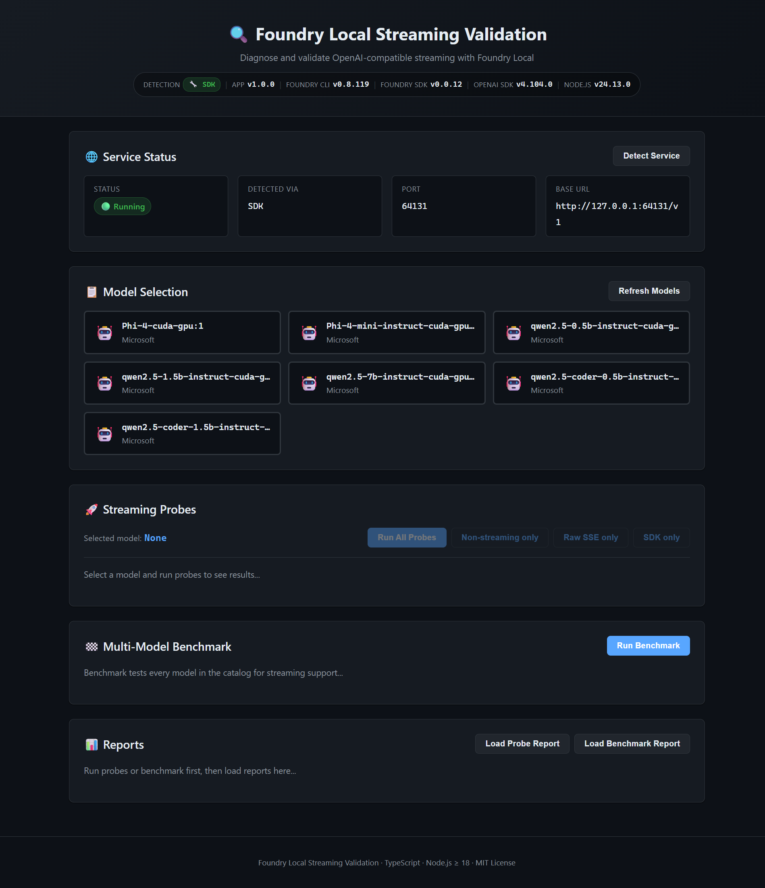

# Building a Streaming Validation Tool for Foundry Local: A Deep Dive

**Testing OpenAI-compatible streaming endpoints doesn't have to be a black box.** In this post, I'll walk you through how we built a comprehensive validation tool for Microsoft's Foundry Local, covering the architecture decisions, implementation patterns, and how you can use it to verify streaming behavior in your own local AI deployments.



## The Problem: Debugging Streaming AI Endpoints

When working with local AI inference servers like Foundry Local, you often encounter a frustrating scenario: your non-streaming requests work perfectly, but streaming requests hang indefinitely or fail silently. The OpenAI-compatible `/v1/chat/completions` endpoint with `stream: true` should return Server-Sent Events (SSE), but debugging why it doesn't is notoriously difficult.

We built **Foundry Local Streaming Validation** to solve this exact problem—a tool that provides deep visibility into every layer of the streaming pipeline.

## Architecture Overview

The tool uses a multi-probe approach to isolate where failures occur:

```
┌─────────────────────────────────────────────────────────────┐
│                    Your Application                          │
├─────────────────────────────────────────────────────────────┤
│  Probe 3: OpenAI SDK    │  Probe 4-5: Foundry SDK           │
├─────────────────────────────────────────────────────────────┤
│  Probe 2: Raw SSE Parser (hand-rolled fetch + async gen)    │
├─────────────────────────────────────────────────────────────┤
│  Probe 1: Non-streaming baseline (fetch, stream: false)     │
├─────────────────────────────────────────────────────────────┤
│                    Foundry Local Service                     │
└─────────────────────────────────────────────────────────────┘
```

Each probe operates at a different abstraction level:

| Probe | Layer | Purpose |
|-------|-------|---------|
| **Non-streaming** | HTTP/JSON | Proves the endpoint is reachable |
| **Raw SSE** | Byte stream | Tests SSE parsing without SDK overhead |
| **OpenAI SDK** | SDK | Reproduces real-world usage patterns |
| **Foundry SDK** | Native | Tests the official Foundry Local SDK |
| **Foundry SDK Streaming** | Native + SSE | Full native streaming path |

## Key Implementation Details

### 1. Dynamic Port Detection

Foundry Local uses dynamic ports, which change on every restart. Instead of hardcoding URLs, we detect the port automatically:

```typescript
// src/service/detect.ts
export function detectFoundryService(timeoutMs: number): ServiceInfo {
  const result = spawnSync("foundry", ["service", "status"], {
    timeout: timeoutMs,
    encoding: "utf-8",
  });

  // Parse: "🟢 Model management service is running on http://127.0.0.1:64131/openai/status"
  const urlMatch = result.stdout.match(/http:\/\/[\d.:]+/);
  if (urlMatch) {
    const url = new URL(urlMatch[0]);
    return {
      running: true,
      host: url.hostname,
      port: parseInt(url.port, 10),
      baseUrl: `http://${url.hostname}:${url.port}/v1`,
    };
  }
  // ...
}
```

This ensures the tool always connects to the correct port without manual configuration.

### 2. Hand-Rolled SSE Parser

Rather than relying on external libraries that might mask issues, we implemented a minimal SSE parser as an async generator:

```typescript
// src/sse/parser.ts
export async function* parseSSE(
  reader: ReadableStreamDefaultReader<Uint8Array>
): AsyncGenerator<SSEEvent> {
  const decoder = new TextDecoder();
  let buffer = "";

  while (true) {
    const { done, value } = await reader.read();
    if (done) break;

    buffer += decoder.decode(value, { stream: true });
    const lines = buffer.split("\n");
    buffer = lines.pop() || "";

    for (const line of lines) {
      if (line.startsWith("data: ")) {
        const data = line.slice(6);
        if (data === "[DONE]") {
          yield { type: "done" };
        } else {
          yield { type: "data", payload: JSON.parse(data) };
        }
      }
    }
  }
}
```

This gives us byte-level visibility into exactly what the server sends and when.

### 3. Three-Layer Timeout Strategy

Streaming endpoints can fail at different stages. We use three distinct timeouts:

```typescript
// src/config.ts
export interface AppConfig {
  requestTimeoutMs: number;      // Overall request limit (30s default)
  firstByteTimeoutMs: number;    // Time to receive HTTP headers (10s)
  firstEventTimeoutMs: number;   // Time to receive first SSE event (15s)
}
```

This allows precise diagnosis:
- **No first byte**: Server not responding at all
- **Headers but no events**: SSE stream opened but no data flowing
- **Some events then timeout**: Partial streaming, possible buffering issue

### 4. Model Alias Resolution

Users often want to use short model names like `phi-4-mini`, but the API requires full variant IDs like `Phi-4-mini-instruct-cuda-gpu:5`. The resolver handles this transparently:

```typescript
// src/models/resolver.ts
export async function resolveModelId(
  baseUrl: string,
  modelAlias: string
): Promise<string> {
  const response = await fetch(`${baseUrl}/models`);
  const { data: models } = await response.json();

  // Exact match
  const exact = models.find((m) => m.id === modelAlias);
  if (exact) return exact.id;

  // Case-insensitive partial match
  const partial = models.find((m) =>
    m.id.toLowerCase().includes(modelAlias.toLowerCase())
  );
  if (partial) {
    console.log(`ℹ  Resolved "${modelAlias}" → "${partial.id}"`);
    return partial.id;
  }

  return modelAlias; // Fall back to original
}
```

### 5. Version Tracking

For debugging and reproducibility, we track versions of all components:

```typescript
// src/utils/version.ts
export function getVersionInfo(method: string): VersionInfo {
  return {
    app: require("../../package.json").version,
    node: process.version.slice(1),
    foundryCli: getFoundryCLIVersion(),
    foundrySDK: getInstalledPackageVersion("@prathikrao/foundry-local-sdk"),
    openaiSDK: getInstalledPackageVersion("openai"),
    detectionMethod: method,
  };
}
```

Both CLI and web dashboard display this on startup:

```
Version Information:
  App version        : 1.0.0
  Node.js            : 24.13.0
  Foundry CLI        : 0.8.119
  Foundry SDK        : 0.0.12
  OpenAI SDK         : 4.104.0
  Detection method   : CLI
```

## Using the Tool

### CLI Mode

The simplest way to run validation:

```bash
# Build first
npm install
npm run build

# Run all probes (auto-detects service and prompts for model)
npm start

# Or specify a model directly
FOUNDRY_MODEL=phi-4-mini npm start
```

The CLI shows an interactive model picker:

```
  Available models:
    1) Phi-4-cuda-gpu:1
    2) Phi-4-mini-instruct-cuda-gpu:5
    3) qwen2.5-0.5b-instruct-cuda-gpu:4
    4) qwen2.5-1.5b-instruct-cuda-gpu:4
    5) qwen2.5-7b-instruct-cuda-gpu:4

  Select a model (1-5) or type model name:
```

### Web Dashboard

For a visual experience, start the web server:

```bash
npm run web
# Open http://localhost:3000
```


The dashboard provides:

1. **Service Detection**: One-click detection of Foundry Local status and port
2. **Model Selection**: Browse and select from available models
3. **Probe Execution**: Run individual probes or all at once
4. **Real-time Results**: See timing metrics, chunk counts, and token previews


### Interpreting Results

Each probe reports detailed metrics:


Key metrics to watch:

- **TTFB (Time to First Byte)**: How long until HTTP headers arrive
- **First Event**: Time until the first SSE `data:` line
- **Chunk Count**: Number of SSE events received
- **[DONE] Received**: Whether the stream terminated properly

### Multi-Model Benchmark

Test streaming support across all your models:

```bash
npm run benchmark
```


The benchmark produces a summary showing which models support streaming and their performance characteristics.

## Diagnostic Decision Tree

When investigating streaming issues, follow this logic:

```
Non-streaming OK?
├── YES → Raw SSE OK?
│   ├── YES → OpenAI SDK OK?
│   │   ├── YES → Foundry SDK OK?
│   │   │   ├── YES → 🎉 All working!
│   │   │   └── NO  → Foundry SDK issue
│   │   └── NO  → OpenAI SDK configuration issue
│   └── NO (NO_FIRST_EVENT) → ⚠️ Server streaming bug
└── NO → Check URL, model name, connectivity
```

## Real-World Example: Debugging a Streaming Hang

Here's a typical debugging session:

```
═══ Probe 1: Non-streaming ═══
✅ OK - 200 in 1234ms

═══ Probe 2: Raw SSE ═══
❌ NO_FIRST_EVENT - Headers received (TTFB: 120ms) but no data events

═══ Probe 3: OpenAI SDK ═══
❌ TIMEOUT - Hung waiting for stream
```

This pattern immediately tells us:
1. The endpoint works (Probe 1 passed)
2. The server accepts `stream: true` and sends headers
3. But it never sends actual SSE events

The fix? Update Foundry Local or check if the specific model supports streaming.

## API Endpoints (Web Dashboard)

The web server exposes a REST API you can integrate with:

```bash
# Check service status
GET /api/status

# Get version info
GET /api/version

# List available models
GET /api/models

# Run all probes
POST /api/probes/all
Content-Type: application/json
{"model": "phi-4-mini"}

# Run single probe
POST /api/probe/raw-streaming
Content-Type: application/json
{"model": "phi-4-mini"}

# Run benchmark
POST /api/benchmark
```

## Key Takeaways

1. **Layer your debugging**: Don't jump straight to SDK issues—validate each layer independently.

2. **Avoid masking problems**: Our hand-rolled SSE parser ensures we see exactly what the server sends.

3. **Automate discovery**: Dynamic port detection and model resolution remove manual configuration friction.

4. **Measure everything**: TTFB, first-event timing, and chunk counts give precise insight into where delays occur.

5. **Provide multiple interfaces**: CLI for automation, web dashboard for exploration.

## Getting Started

```bash
git clone <repo-url>
cd foundry-local-streaming-validation
npm install
npm run build

# CLI mode
npm start

# Web dashboard
npm run web
```

The tool requires Node.js ≥ 18 and a running Foundry Local instance. See the [README](README.md) for complete documentation.

---

**Questions or feedback?** Open an issue or submit a PR. We welcome contributions to make local AI debugging easier for everyone.
